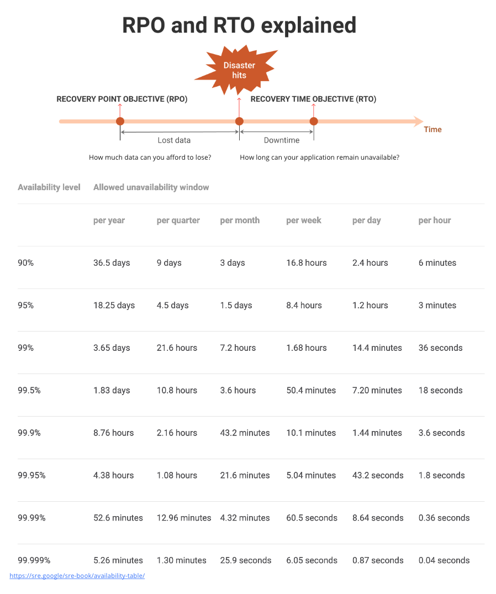

# Backup Best Practices and Strategies

Backup strategies and best practices using Velero for Kubernetes clusters involve defining the scope, schedule, and retention policies for your backups. The strategy you choose depends on your application's requirements, data sensitivity, and recovery objectives.

## Key Elements of DR

* What were the drivers and why?
* What business continuity metrics/measures do you have for your applications and Platform?
* What are the applications and the backing services: A platform with multi-site capability does not automatically grant such high availability feature to applications. Applications also need to handle multi-site high availability, especially, how it manages its data.
* Budgetary Constraints:  Are there any budget contraints?
* DR Plans: Do you have a Business Continuity team or have plans? Defines who is involved and what each person is doing and when.
* Testing: All DR should be tested. This includes backups and testing multi-site failover, like a fire-drill.

## Recovery Time Objective (RTO) & Recovery Point Objective (RPO)

Before defining a DR strategy it is critical to first know two key metrics Recovery Time Objective (RTO) & Recovery Point Objective (RPO), which represent the amount of time a business unit/organization can allow an application to be down and the amount of data (measured in time) that a business unit/organization can afford to lose, respectively. For example, an RTO of 1 hr and RPO of 1 hr, means that an application can only be allowed to be down for at most 1 hour and can afford to lose 1 hour of data (perhaps because an application can re-create the data or that the data is recoverable by some other means that minimizes cost).  

Both metrics represent an upper bound threshold which can be used to optimize DR strategies to minimize cost while maximizing availability. Further, RPO and RTO are generally defined for each application and it is not unusual for organizations to have a specific team that that apply a 'Tier' based approach to classify applications, wherein each tier defines a set of business continuity requirements with RTO/RPO requirements. It should be noted that generally the RTO/RPO of a platform usually translates to the application that has the strictest RTO/RPO. Hence, sometimes it may be cost-effective to split applications according to their RTO/RPO on a per foundation basis.

## DR/Backup Best Practices

* Determine RTO/RPO metrics.
* Determine your backup strategy, including what namespaces, resources, and schedules you want to use for backups.
* Consider creating different backup schedules for critical and non-critical workloads.
* Implement a retention policy to manage the lifecycle of your backups.
* Custom Resources: Be aware of custom resources and objects in your Kubernetes clusters. Velero might not natively back up custom resources, so you may need to create custom resource definitions (CRDs) or backup hooks to handle them.
* Disaster Recovery Testing: Periodically test your backup and restore process to ensure that it works as expected. You don't want to discover issues during an actual disaster.
* Logging and Monitoring: Set up logging and monitoring for your Velero backups. This can help you identify any potential issues or anomalies in the backup process.
* Cluster Snapshots: In addition to application-level backups, consider using EKS cluster snapshots for capturing the state of the entire EKS cluster. This can be useful for disaster recovery scenarios.
* Documentation: Document your backup and restore procedures and keep them up to date. Ensure that your team knows how to use Velero effectively for backup and recovery tasks.
* Regular Updates: Keep Velero and its associated components up to date with the latest releases and security patches.
* Testing and Validation: Before relying on Velero for production backups, thoroughly test it in a staging or non-production environment to ensure that it meets your requirements and performs as expected.
* Resource Allocation: Adequately allocate resources (CPU and memory) to Velero pods to ensure smooth operation.
* Backup Reports: Use Velero's reporting features to generate backup status reports and logs regularly. This can help you keep track of your backup history and identify any issues.
* Regularly review and update your backup strategy to adapt to changing requirements and technologies.

## Backup Strategies

### Full Cluster Backup

* Scope: Back up the entire Kubernetes cluster, including all namespaces and resources.
* Use Case: Suitable for small clusters or when you need to back up everything for disaster recovery.
* Pros: Provides a comprehensive backup of the entire cluster.
* Cons: Backup files can be large, and restoration might take longer.

### Namespace-Level Backup:

* Scope: Back up specific namespaces or a selection of namespaces.
* Use Case: Useful for isolating backups for different teams or applications within a shared cluster.
* Pros: More targeted and efficient backups, especially in large clusters.
* Cons: Requires careful selection of namespaces, and you need to manage multiple backups for different namespaces.

### Application-Level Backup:

* Scope: Back up specific applications or microservices within namespaces.
* Use Case: Ideal for environments with multiple applications sharing namespaces. It allows you to back up only what's essential.
* Pros: Granular control over what gets backed up, reducing backup size.
* Cons: Requires careful resource labeling or annotation to identify and select specific applications.

### Scheduled Backups:

* Schedule: Set up recurring backups on a predefined schedule (e.g., daily, weekly).
* Use Case: Ensure regular data protection without manual intervention.
* Pros: Automates the backup process, reducing the risk of forgetting to back up.
* Cons: May lead to storage consumption if retention policies are not defined properly.

### On-Demand Backups:

* Scope: Initiate backups manually when needed.
* Use Case: Provides flexibility to create backups on an ad-hoc basis, such as before making significant changes or updates.
* Pros: Full control over when backups are taken.
* Cons: Requires manual intervention and oversight.

### Retention Policies:

* Define retention policies to manage the lifecycle of your backups.
* Use Case: Specify how long backups are retained before being automatically deleted.
* Pros: Ensures that backup storage does not grow indefinitely and complies with data retention policies.
* Cons: Careful planning is needed to balance the need for long-term retention with storage costs.

### Custom Resource and Hook Backups:

* Scope: Configure Velero to back up custom resources or execute pre/post backup hooks for specific applications.
* Use Case: Needed when you have custom resources or complex application requirements that Velero does not natively support.
* Pros: Extends Velero's capabilities to handle non-standard resources or data sources.
* Cons: Requires additional configuration and scripting.

### Combination Strategy:

Combine different backup strategies based on your cluster's requirements. For example, you might use full cluster backups for disaster recovery and application-level backups for individual application teams.