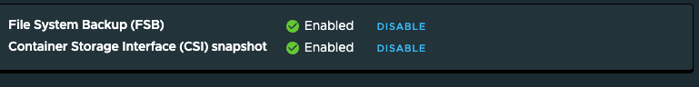

# Get your Cluster Ready for Data Protection with TMC

This guide walks you through getting your EKS cluster ready for data protection and how to prepare your cluster to enable CSI Snapshots. 

It is recommended that you enable both FSB and CSI volume snapshots when backing up a cluster. 

The VMware Documentation can be found [here](https://docs.vmware.com/en/VMware-Tanzu-Mission-Control/services/tanzumc-concepts/GUID-C16557BC-EB1B-4414-8E63-28AD92E0CAE5.html?hWord=N4IghgNiBcICZgC5gAQAcBOB7RBTAxogJZYB2IAvkA) and it is recommended to read these instructions first and become familar with the concepts. 

## Preparing Your Cluster for CSI Volume Snapshots

You need to prepare your cluster to install a new StorageClass to use the CSI Driver, Volume Snapshot CRDs, and finally the Volume Snapshot Controller. These next steps follows this [guide.](https://aws.amazon.com/blogs/containers/using-ebs-snapshots-for-persistent-storage-with-your-eks-cluster/)

### Add a new Storage Class

EKS clusters come with the gp2 storageclass by default, but this doesn't come with CSI driver support. gp3 volumes are cheaper and faster supposedly, so this is a good time to install a new default storage class and convert over to gp3 and use the CSI driver.

* [Why is it Time to Make the Switch to GP3](https://medium.com/@theintrovertalert/gp2-vs-gp3-why-its-time-to-make-the-switch-for-better-aws-ec2-performance-cf777f0a936a#:~:text=GP3%20volumes%20are%20designed%20to,%2C%20and%20high%2Dtraffic%20applications.)

Let's first create a new storageclass and make it default (Note the encrypted parameter. Set this if you want encrypted volumes provisioned):

```
apiVersion: storage.k8s.io/v1
kind: StorageClass
metadata:
  annotations:
    storageclass.kubernetes.io/is-default-class: "true"
  name: gp3
parameters:
  type: gp3
  encrypted: "true"
provisioner: ebs.csi.aws.com
reclaimPolicy: Delete
volumeBindingMode: WaitForFirstConsumer
allowVolumeExpansion: true
```

Next delete your old storageclass gp2 as it's no longer needed.

```
k delete sc gp2
```

### Install Volume Snapshot CRDS

You need to install the Volume Snapshot CRDS:

```
kubectl apply -f https://raw.githubusercontent.com/kubernetes-csi/external-snapshotter/master/client/config/crd/snapshot.storage.k8s.io_volumesnapshotclasses.yaml

kubectl apply -f https://raw.githubusercontent.com/kubernetes-csi/external-snapshotter/master/client/config/crd/snapshot.storage.k8s.io_volumesnapshotcontents.yaml

kubectl apply -f https://raw.githubusercontent.com/kubernetes-csi/external-snapshotter/master/client/config/crd/snapshot.storage.k8s.io_volumesnapshots.yaml
```

### Install Snapshot Controller

Install the Snapshot Controller:

```
kubectl apply -f https://raw.githubusercontent.com/kubernetes-csi/external-snapshotter/master/deploy/kubernetes/snapshot-controller/rbac-snapshot-controller.yaml

kubectl apply -f https://raw.githubusercontent.com/kubernetes-csi/external-snapshotter/master/deploy/kubernetes/snapshot-controller/setup-snapshot-controller.yaml

```

### Create a VolumeSnapshotClass

You need to create a VolumeSnapshotClass with the same name as the driver and the ```velero.io/csi-volumesnapshot-class: "true"``` label on it:

* [Velero CSI Documentation](https://velero.io/docs/main/csi/)

```
apiVersion: snapshot.storage.k8s.io/v1
kind: VolumeSnapshotClass
metadata:
  name: aws-ebs-csi-driver
  labels:
    velero.io/csi-volumesnapshot-class: "true"
driver: ebs.csi.aws.com
deletionPolicy: Delete
```

## Conclusion

You have now prepared your cluster to support CSI Volume Snapshots and you should see FBS and CSI data protection enabled within the TMC console (After you turn it on of course):



### Relevant Documents:

* [Upgrade Default Storage Class](https://medium.com/@argonaut.dev/upgrade-default-storage-class-for-eks-42193f288b4e)
* [Change your Default Storage Class](https://kubernetes.io/docs/tasks/administer-cluster/change-default-storage-class/)
* [Migrate your Amazon EBS Volumes to GP3](https://aws.amazon.com/blogs/storage/migrate-your-amazon-ebs-volumes-from-gp2-to-gp3-and-save-up-to-20-on-costs/)
* [Velero CSI Documentation](https://velero.io/docs/main/csi/)
* [AWS: Using EBS Snapshots for PV Storage with EKS](https://aws.amazon.com/blogs/containers/using-ebs-snapshots-for-persistent-storage-with-your-eks-cluster/)
* [VMware: TMC Data Protection Concepts](https://docs.vmware.com/en/VMware-Tanzu-Mission-Control/services/tanzumc-concepts/GUID-C16557BC-EB1B-4414-8E63-28AD92E0CAE5.html?hWord=N4IghgNiBcICZgC5gAQAcBOB7RBTAxogJZYB2IAvkA)

### Sample Code (Broken in AWS's Site)
* https://github.com/kubernetes-sigs/aws-ebs-csi-driver/tree/master/examples/kubernetes/storageclass/manifests

