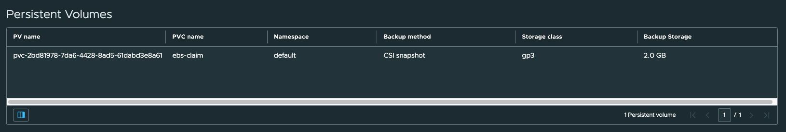
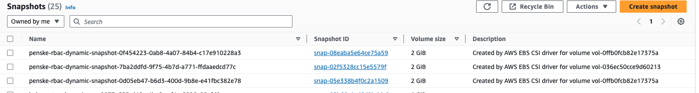

# Test a CSI Volume Snapshot with TMC

You can test the CSI Volume Snapshot works by create a PVC and a Pod and then create a backup. This guide will walk you through how to quickly test out a CSI Snapshot was successful.

## Create a PVC and a Pod

Make sure you have the right Storage Class setup first before applying these resources: 

```
apiVersion: v1
kind: PersistentVolumeClaim
metadata:
  name: ebs-claim
spec:
  accessModes:
    - ReadWriteOnce
  storageClassName: gp3
  resources:
    requests:
      storage: 2Gi
---
apiVersion: v1
kind: Pod
metadata:
  name: app
spec:
  containers:
  - name: app
    image: centos
    command: ["/bin/sh"]
    args: ["-c", "while true; do echo $(date -u) >> /data/out.txt; sleep 5; done"]
    volumeMounts:
    - name: persistent-storage
      mountPath: /data
  volumes:
  - name: persistent-storage
    persistentVolumeClaim:
      claimName: ebs-claim
```

Run the following command to check for data:

```
kubectl exec -it app -- cat /data/out.txt
```

## Create a Backup

Now you can create a backup in TMC. You can confirm the CSI backup worked properly by checking in TMC that the backup method of CSI:



You can now check the volume snapshots in AWS console. Velero creates a 



## Recover 

Use TMC to recover the namespace that contains the Pod and PersistentVolumeClaim onto a new cluster. You should now be able to run the following command to see the previous output:

```
kubectl exec -it app -- cat /data/out.txt
```


